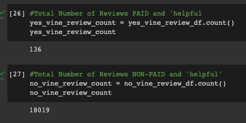

# Amazon_Vine_Analysis

## Overview
The goal of this project is to analyze Amazon Vine program. Amazon Vine allows manufacturers and publishers to receive reviews for their products. Companies pay a small fee to Amazon in order to provide products to Amazon Vine members who then are required to write and publish a review. 

To narrow down the analysis to 1 category from the catalog of Vine data which can be found here [https://s3.amazonaws.com/amazon-reviews-pds/tsv/index.txt] I have selected to analyzed the Furniture dataset. 

Due to the amount of data in the original dataset we are going to use PySpark to perform the ETL process. Tools used in the analysis are as follows:

- Amazon AWS
  - S3
  - RDS with PostgreSQL
- PySpark
- Google Colab
- pgAdmin

## Results 
1. How many VineTOT reviews and non-Vine reviews were there?
- 

2. How many Vine reviews were 5 stars? How many non-Vine reviews were 5 stars?
- 

3. What percentage of Vine reviews were 5 stars? What percentage of non-Vine reviews were 5 stars?
- 

## Summary 
It appears there seems to be a slight bias for paid reviews to be 5 stars in the furtinture data set. There is a 7% difference between 5 star reviews of paid (54%) vs non paid (47%) reviews.